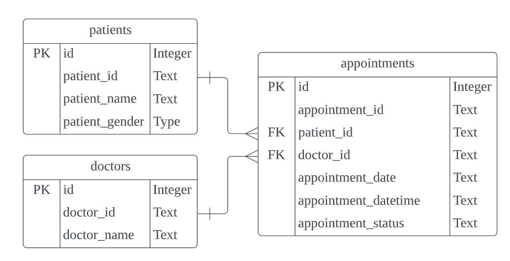

# data4life_assignment

## Getting started

Set up a virtual environment for the project:  
`python3 -m venv virtualenv`

Activate the environment:  
`source virtualenv/bin/activate`

Install the dependencies:  
`pip install -r requirements.txt`

Run the API with Uvicorn:  
CD into app directory and run this command `uvicorn src.main:app --reload`

## Interacting with the Web API
Go to this url in a browser `http://127.0.0.1:8000/docs`

## Assignment Details

### Identify the entities & relations. Load the given CSV data into the objects

Relational Model
- There are 3 entities all together - patients, doctors, appointments
- Doctors and appointments share a one-to-many relationship through the common field doctor_id. One doctor can have many appointments, but only one appointment can have one doctor.
- There is a unique constraint placed on doctors.doctor_id which allows it to act as a foreign key in appointments even though it is not a primary key in doctors.
- Patients and appointments also share a one-to-many relationship through the common field patient_id. One patient can have many appointments, but only one appointment can have one patient.
- There is a unique constraint placed on patients.patient_id which allows it to act as a foreign key in appointments even though it is not a primary key in patients.
- Appointments table also acts as an association table for the many-to-many relationship between doctors and patients.
patient_gender could be a table in itself and would shae a one-to-many relationship with patients. Same for appointment_status. But since data is limited (for this assignment) and performance is not an issue, both were kept as columns in their respective tables.

### Get all appointments for the given doctor & date
- Use Q2_get_doctor_appointments

### Fix appointment by patient, doctor and date & time
- Use Q3_fix_appointment

### Cancel appointment by patient, doctor and date & time
- Use Q4_cancel_appointment

## Assumptions
### Assumptions made for appointments
- Consultation is 8am to 4pm meaning 3pm is the last appointment time since each consultation is an hour
- Doctors have no lunch breaks and are available every day of the week i.e. Appointments can be made anytime from 8am to 4pm, 7 days a week
- Appointments have only 2 statuses - ‘Confirmed’ and ‘Cancelled’
- appointment_id e.g. A1, A2 is unique
- appointment_id is generated based on entry to database i.e. ‘A’ prepended to an auto-incrementing id integer on inserted record

### Assumptions made for doctors
- doctor_id e.g D1, D2 is unique
- doctor_id is generated based on entry to database i.e. ‘D’ prepended to an auto-incrementing id integer on inserted record
- doctor_name e.g. D1Name, D2Name is unique

### Assumptions made for patients
- patient_id e.g P1, P2 is unique
- patient_id is generated based on entry to database i.e. ‘P’ prepended to an auto-incrementing id integer on inserted record
- patient_name e.g. P1Name, P2Name is unique
- patient_gender only has 2 values - ‘M’ and ‘F’
